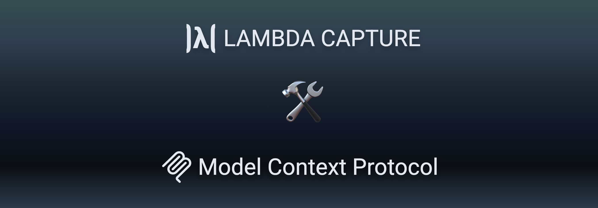

# Lambda Capture MCP Server
[](https://lambda-capture.com/) [](https://lambda-capture.com/)  
MCP implementation of our standard [Semantic Search API for Macroeconomic Data](https://github.com/lambda-capture/Semantic-Search-API)

## Remote MCP Server (streamable HTTP)
Check server status [HERE](https://mcp.lambda-capture.com/)
### [OpenAI Responses API](https://platform.openai.com/docs/guides/tools-remote-mcp)
```python

from openai import OpenAI

client = OpenAI()

resp = client.responses.create(
    model="gpt-4.1",
    input="Key shifts in inflation expectations",
    tools=[
        {
            "type": "mcp",
            "server_label": "lambda-capture",
            "server_url": "https://mcp.lambda-capture.com/v1/mcp/",
            "headers": {
                "Authorization": "Bearer YOUR_ACCESS_TOKEN"
            }
        }
    ]
)

print(resp.output_text)
```  
### Curl 
```bash

curl -X POST "https://mcp.lambda-capture.com/v1/mcp/" \
-H "Content-Type: application/json" \
-H "Accept: application/json, text/event-stream" \
-H "Authorization: Bearer YOUR_ACCESS_TOKEN" \
-d '{
  "jsonrpc": "2.0",
  "method": "tools/call",
  "id": 1,
  "params": {
    "name": "macroecon_semantic_search",
    "arguments": {
      "query_text": "inflation expectations",
      "max_results": 3,
    }
  }
}'
```
```bash

curl -X POST "https://mcp.lambda-capture.com/v1/mcp/" \
-H "Content-Type: application/json" \
-H "Accept: application/json" \
-H "Authorization: Bearer YOUR_ACCESS_TOKEN" \
-d '{
    "jsonrpc": "2.0",
    "id": "1",
    "method": "list_tools",
    "params": {}
}'
``` 
### Configure your MCP Client (Claude Desktop App)
Go to Claude -> Settings -> Developer -> Edit Config. Add the following to your `claude_desktop_config.json`
#### Node: 
```json
{
  "mcpServers": {
    "lambda-capture-mcp": {
      "command": "npx",
      "args": [
        "mcp-remote",
        "https://mcp.lambda-capture.com/v1/mcp/",
        "--header", "Authorization: Bearer YOUR_ACCESS_TOKEN"
      ],
      "description": "RemoteMCP with Lambda Capture Macroeconomic Data API"
    }
  }
}
```  
## Local MCP Server
### Pre-requisites
- [Lambda Capture API key](https://lambda-capture.com/)
- for MCP Typescript: [Node.js 18+ (includes npx and npm)](https://nodejs.org/en/download/)
- for MCP Python: [Python 3.11+](https://www.python.org/downloads/)

### Installation
1. Clone the repo  
#### Node:
2. `npm install` to install the dependencies
3. `npm run build` to build the project  
#### Python:
2. `python -m venv .venv` create virtual environment
3. `source .venv/bin/activate` activate virtual environment
4. `pip install -r requirements.txt` install the dependencies

### Configure your MCP Client (Claude Desktop App)
Go to Claude -> Settings -> Developer -> Edit Config. Add the following to your `claude_desktop_config.json`
#### Node: 
```json
{
  "mcpServers": {
    "lambda-capture-mcp": {
      "command": "node",
      "args": [
        "/Absolute Path to/mcp-server/dist/index.js"
      ],
      "env": {
        "LAMBDA_CAPTURE_API_KEY": "Your API Key string"
      },
      "description": "Runs the Node MCP with Lambda Capture Macroeconomic Data API"
    }
  }
}
```  
#### Python: 
```json
{
  "mcpServers": {
    "lambda-capture-mcp": {
      "command": "/Absolute Path to/.venv/bin/python",
      "args": [
        "/Absolute Path to/mcp-server/main.py"
      ],
      "env": {
        "LAMBDA_CAPTURE_API_KEY": "Your API Key string"
      },
      "description": "Runs the Python MCP with Lambda Capture Macroeconomic Data API"
    }
  }
}
```
### Context Window Size
Adjust `maxTokens` (.ts) or `max_tokens` (.py) variables, based on context window size of your model (doesn't count metadata, just content tokens)  

© 2025 Lambda Capture Limited (Registration Number 15845351) 52 Tabernacle Street, London, EC2A 4NJ - All rights reserved
